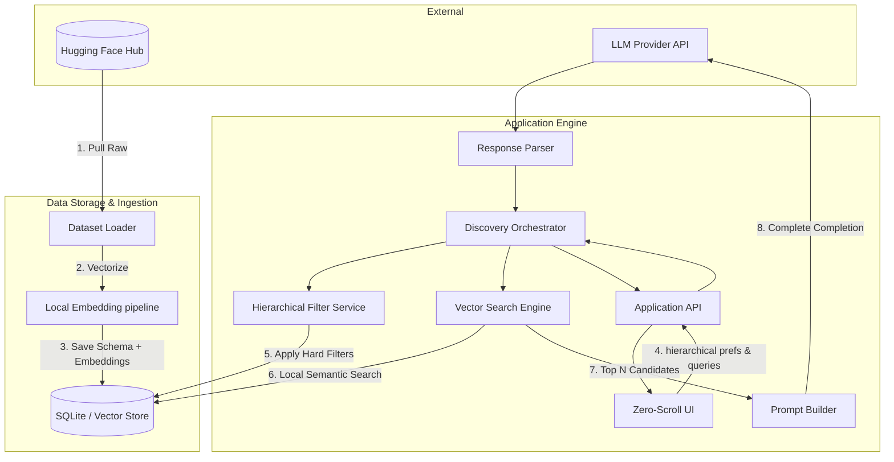
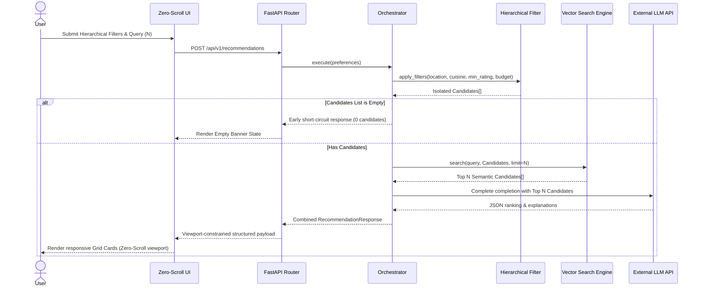

# Architecture: AI-Powered Restaurant Discovery Engine (Zero-Scroll & Context-Aware)

This document describes the technical architecture for the Zomato-inspired restaurant discovery engine. It is derived from [Docs/context.md](./context.md) and defines components, data flows, interfaces, and viewport constraints for a greenfield build.

---

## Table of Contents
1. Goals and Constraints
2. High-Level Architecture & Flow
3. Logical Layers
4. Component Design
5. Data & Vector Architecture
6. Sequence Lifecycle
7. LLM Integration Layer
8. API Design
9. Zero-Scroll Viewport Presentation Layer
10. Cross-Cutting Concerns
11. Repository Structure
12. Technology Options
13. Testing Strategy

---

## 1. Goals and Constraints

### Primary Goals
*   **Sequential Hierarchy Filtering:** Programmatic, top-down dependent matching (Location $\rightarrow$ Cuisine $\rightarrow$ Rating $\rightarrow$ Budget Band) to isolate candidate boundaries.
*   **Semantic Matching:** Leverage local Hugging Face embedding pipelines to vectorize text structures and match additional qualitative preferences without sending data outside the local pipeline.
*   **Strict Grounding:** Suggestions must match real Zomato entries; the LLM is prohibited from inventing or suggesting items outside the candidate set.
*   **Zero-Scroll Viewport Layout:** The frontend interface fits strictly within $100\text{vh}$ and $100\text{vw}$. The display adjusts grid configurations to fit recommendations programmatically.

### Architectural Constraints
*   **Capacity Range Constraint ($N$):** Number of requested recommendations is bound strictly where $1 \le N \le 10$.
*   **Local Processing of Vectors:** All embedding vector generations must run locally (e.g. via `transformers` / `sentence-transformers`) on server/app boot or during offline setup.
*   **Deterministic Capping:** Hard limits ($N$) are enforced programmatically during vector retrieval to control the LLM's context size.

### Out of Scope (Initial Milestone)
*   User profiles, bookmark history, active checkout cart, or ordering APIs.
*   Real-time restaurant reservation systems or live Zomato endpoints.
*   Fine-tuning custom open-source foundation models.

---

## 2. High-Level Architecture & Flow

The system runs as an integrated data filtering and semantic retrieval pipeline:



---

## 3. Logical Layers

*   **Presentation Layer (Zero-Scroll Viewport):** Captures explicit hierarchical inputs. Adapts self-adjusting grid layouts programmatically based on $N$ ($1 \le N \le 10$) so the viewport never scrolls.
*   **API & Application Layer:** Performs validation, handles mapping, coordinates services, and processes structured JSON endpoints.
*   **Domain & Vector Search Layer:** Handles sequential dependent filters, generates query embeddings locally, executes semantic cosine similarity indexing, and manages candidate context.
*   **Integration Layer (LLM Client):** Packages grounding prompts, handles external model retries, parses JSON outputs via robust regex fallback buffers, and maps IDs.
*   **Data Ingestion & Store Layer:** Fetches raw dataset, extracts semantic metadata, converts text representations into dense vectors locally, and manages transactional state.

---

## 4. Component Design

### 1. Ingestion Pipeline
*   **DatasetLoader:** Fetches `ManikaSaini/zomato-restaurant-recommendation` from HF.
*   **SchemaNormalizer:** Maps target schemas: Restaurant Name, Location, Cuisine, rating, cost-for-two.
*   **Local Embedding Generator:** Uses a local sentence-transformer pipeline (e.g. `all-MiniLM-L6-v2`) to generate local dense vector representations of restaurant metadata and combined textual features.
*   **PersistenceWriter:** Writes normalized data and binary vectors to SQLite or local Parquet stores.

### 2. Hierarchical Filter Service
*   Applies a strict sequential hierarchy:
    *   **Filter 1:** Match string exact/substring locality (`Location`).
    *   **Filter 2:** Match target list culinary categories (`Cuisine`).
    *   **Filter 3:** Validate quality ranges (`Minimum Rating` $\ge$ Threshold).
    *   **Filter 4:** Validate financial boundary categorizations (`Budget Band`).
*   Output constraints: Zero-candidate configurations short-circuit early, bypassing downstream vector search and LLM calls.

### 3. Vector Search Engine
*   Translates user-defined qualitative preferences (e.g. "rooftop garden, quiet ambient music") into a local embedding using the same local model.
*   Computes Cosine Similarity against the candidates isolated by the Hierarchical Filter Service.
*   Applies a strict cap ($N$) to retain the top $N$ semantic candidate matches.

### 4. Prompt Builder
*   Serializes candidate metadata (Name, Cuisine, Rating, Cost, Location) into structured markdown context.
*   Adds instructions: Rank the candidates, output strictly in JSON, and justify recommendations with custom descriptions using only facts inside the candidate dataset.

### 5. Response Parser & Orchestrator
*   Extracts JSON blocks using regular expression boundary matching.
*   Matches returned candidate recommendation IDs against the original list to enforce hard grounding.
*   Fails gracefully using ratings-based defaults if the external API returns malformed structures or connections time out.

---

## 5. Data & Vector Architecture

### Restaurant Domain Model
```python
class Restaurant:
    id: str                 # Unique ID
    name: str               # Restaurant Name
    location: str           # Locality / Area
    cuisines: list[str]     # Cuisines
    rating: float           # Numeric rating
    estimated_cost: float   # Cost for two
    budget_band: str        # low | medium | high
    embedding: list[float]  # Local dense vector (e.g., 384 dimensions)
```

### User Input State (Sequential Dependent Structure)
```python
class UserPreferences:
    location: str                          # Step 1 Filter
    cuisine: str                           # Step 2 Filter
    min_rating: float                      # Step 3 Filter
    budget: Literal["low", "medium", "high"] # Step 4 Filter
    additional_preferences: str            # Semantic query
    top_n: int                             # Capacity: 1 <= N <= 10
```

---

## 6. Sequence Lifecycle



---

## 7. LLM Integration Layer

*   **Grounding Enforcement:** Prompts detail that recommendations *must* only exist inside the candidate array provided. If the LLM generates a non-existent ID, the orchestrator strips it from the final card assembly.
*   **Structured Output Contract:**
    ```json
    {
      "summary": "Brief summary text context.",
      "recommendations": [
        {
          "restaurant_id": "r101",
          "rank": 1,
          "explanation": "Custom generated reason why it matches semantic inputs."
        }
      ]
    }
    ```

---

## 8. API Design

*   `POST /api/v1/recommendations`: Processes hierarchical filters, qualitative preferences, and capacity ($N$). Returns recommendation models.
*   `GET /api/v1/metadata/locations`: Returns valid locations for dropdowns/autocomplete.
*   `GET /api/v1/metadata/cuisines`: Returns valid cuisines list.
*   `GET /api/v1/health`: Ingestion status and database connectivity.

---

## 9. Zero-Scroll Viewport Presentation Layer

The interface layout enforces a **strict zero-scroll policy** completely fitting in $100\text{vh}$ / $100\text{vw}$.

### Layout Adaptability Grid (CSS Flexbox/Grid Logic)
*   **Viewport Shell:** CSS `height: 100vh; overflow: hidden; display: flex; flex-direction: column;` prevents system scrollbars.
*   **Interactive Control Panel:** Takes a fixed vertical allocation (e.g., $25\%$ of height). Includes sequential dependent selection menus.
*   **Results Area Grid:** Dynamic grid allocating remaining screen space ($75\%$). Programmatic CSS rules adjust height and margins depending on $N$ ($1 \le N \le 10$):
    *   **$N = 1$:** Grid allocates 1 prominent card filling the dynamic layout.
    *   **$N \le 3$:** Grid allocates cards in 1 row, stretching width.
    *   **$N \le 6$:** Grid shifts to 2 rows of 3 columns, adjusting padding down to fit perfectly.
    *   **$N \le 10$:** Grid aligns cards in 2 rows of 5 columns, scaling fonts and margins to guarantee containment.

---

## 10. Repository Structure

```text
zomato-milestone/
├── docs/
│   ├── context.md
│   ├── architecture.md
│   └── implementation-plan.md
├── data/
│   └── processed/
│       ├── restaurants.sqlite
│       └── embeddings.npy
├── src/
│   └── app/
│       ├── __init__.py
│       ├── main.py              # Entry Point
│       ├── config.py            # App Settings
│       ├── models/
│       │   ├── __init__.py
│       │   └── domain.py        # Pydantic schemas
│       ├── ingestion/
│       │   ├── loader.py        
│       │   ├── normalizer.py    # Schema standardization
│       │   └── pipeline.py      # Local indexing pipeline
│       ├── data/
│       │   └── repository.py    # DB queries
│       ├── services/
│       │   ├── filter_service.py # Hierarchical constraints
│       │   ├── vector_search.py  # Local similarity engine
│       │   ├── prompt_builder.py
│       │   ├── llm_client.py
│       │   ├── response_parser.py
│       │   └── orchestrator.py
│       └── api/
│           ├── routes.py        # FastAPI Routers
│           └── schemas.py
├── scripts/
│   └── ingest.py                # Command to trigger ingestion
├── requirements.txt
└── README.md
```

---

## 11. Technology Options

*   **Local Embeddings Model:** `sentence-transformers/all-MiniLM-L6-v2` (fast CPU-level execution, 384 dimensions).
*   **Local Storage Engine:** SQLite storing restaurant text parameters alongside Numpy arrays for embedding indices, or FAISS.
*   **Web Framework:** FastAPI for backend API routing.
*   **Web UI Presentation:**
    *   **Option A:** Streamlit customized with viewport margins (`st.markdown("<style>...</style>")` removing vertical pads) for zero-scroll.
    *   **Option B (Recommended):** React SPA + Tailwind CSS utilizing dynamic viewport sizing (`h-screen`, `grid-cols-N`, `w-full`, `overflow-hidden`).
