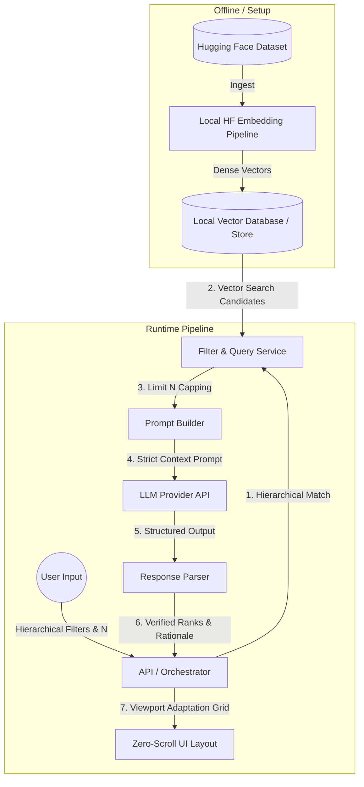

# Zomato Restaurant Discovery Engine — Project Context

This document defines the core problem statement, system objectives, architecture, and constraints for the **AI-Powered Zomato Restaurant Discovery Engine**. It serves as the single source of truth for the project context and system boundaries.

---

## 1. Problem Statement

Modern restaurant discovery platforms often lead to "discovery overload" due to overwhelming options and scrolling interfaces. Traditional interfaces also fail to leverage semantic nuances in user queries (e.g., "vibrant rooftop vibe for a birthday party" or "quiet corner with fast Wi-Fi for studying").

This project addresses these challenges by building a **Lightweight, Zero-Scroll, Single-Screen AI-Powered Discovery Engine** that:
*   Processes hierarchical inputs systematically.
*   Performs local semantic vector search against a Zomato dataset.
*   Utilizes a Large Language Model (LLM) to rank the options and generate custom explanations.
*   Renders all results in a responsive, **zero-scroll layout** completely contained within the viewport (`100vh` / `100vw`).

### Core Problems Addressed
*   **Discovery Overload:** Systematically narrowing the search space through sequential filters.
*   **Semantic Nuances:** Capturing qualitative preferences via dense vector embeddings generated locally using a Hugging Face model/tokenizer.
*   **Data Grounding & Trust:** Every recommendation maps strictly to a real Zomato restaurant dataset (Hugging Face `ManikaSaini/zomato-restaurant-recommendation`) to prevent LLM hallucinations.
*   **Viewport Constraints (Zero-Scroll):** Enforcing a strict design restriction where the user interface fits entirely within one screen, programmatically adjusting grid structures so the user never has to scroll to read or filter recommendations.

---

## 2. System Goals & Objectives

1.  **Strict Dependent Hierarchy Filtering:** Apply deterministic filters sequentially (`Location` $\rightarrow$ `Cuisine` $\rightarrow$ `Minimum Rating` $\rightarrow$ `Budget Band`) to isolate candidates.
2.  **Local Embedding Generation:** Run a local transformers model (e.g., sentence-transformers or basic huggingface pipeline) to vectorize restaurant features locally, providing search grounding without exposing data externally.
3.  **Deterministic Capacity Control ($N$):** Bind recommendations to a strict range where $1 \le N \le 10$, dynamically passing only $N$ candidate items to the LLM.
4.  **Zero-Scroll Mandate:** Ensure the frontend viewport fits strictly within $100\text{vh}$ and $100\text{vw}$. The card grid must adjust programmatically—e.g., single card optimized to fill the layout for $N=1$, and scaled down multi-row/multi-column grid for $N=10$.
5.  **LLM-Powered Ranking & Explanation:** Augment the final prompt with candidate metadata to generate a ranked recommendation response containing tailored explanations of *why* each choice matches the user's qualitative preferences.

---

## 3. High-Level Pipeline Architecture

The application functions as a highly optimized, local vector search and LLM completion pipeline:



---

## 4. Technology Stack & Dataset Source

### Dataset Source
*   **Provider:** Hugging Face Hub
*   **Dataset Name:** `ManikaSaini/zomato-restaurant-recommendation`
*   **Key Fields:** `name`, `location`, `cuisines`, `rating`, `estimated_cost`, and combined text features.

### Technical Stack
*   **Runtime Environment:** Python 3.11+
*   **Data Ingestion & Local Embedding:** `pandas`, `datasets`, `transformers` / `sentence-transformers` (for local dense vector representations)
*   **Local Storage:** SQLite or Parquet (combined with simple numpy or FAISS search indexing)
*   **LLM API:** Groq API (strictly utilizing `llama-3.3-70b-versatile` for ranking and explainability)
*   **Presentation Layer:** Streamlit (rapid prototyping with viewport containment) or React + FastAPI (full zero-scroll CSS grid layout)

---

## 5. Domain Models & Schema Definition

### Canonical Restaurant Model
```python
class Restaurant:
    id: str                 # Unique hash or index
    name: str               # Restaurant Name
    location: str           # City / Locality
    cuisines: list[str]     # Standardized list of cuisines
    rating: float           # Aggregated numerical rating
    estimated_cost: float   # Estimated cost for two
    budget_band: str        # Category: low | medium | high
    text_representation: str # Flattened text representation for embedding
```

### Budget Band Categorization
*   **Low Budget:** Cost for two $\le 500$
*   **Medium Budget:** $500 < \text{Cost for two} \le 1500$
*   **High Budget:** Cost for two $> 1500$
