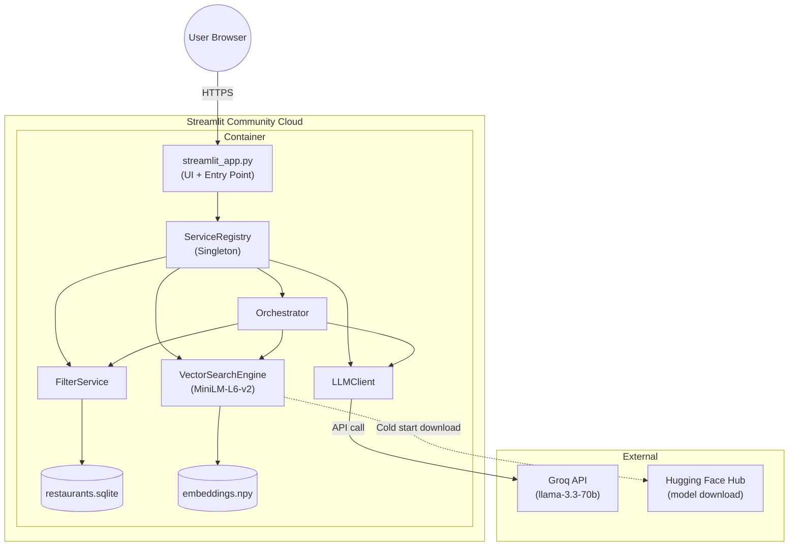

# Deployment Plan — Streamlit Community Cloud

This document outlines the complete strategy to deploy the **TasteFinder AI – Zomato Restaurant Discovery Engine** on [Streamlit Community Cloud](https://streamlit.io/cloud).

---

## Table of Contents

1. [Current Architecture vs Streamlit](#1-current-architecture-vs-streamlit)
2. [Pre-Deployment Checklist](#2-pre-deployment-checklist)
3. [Repository Preparation](#3-repository-preparation)
4. [Streamlit App File — `streamlit_app.py`](#4-streamlit-app-file--streamlit_apppy)
5. [Secrets & Environment Configuration](#5-secrets--environment-configuration)
6. [Data & Model Artifacts](#6-data--model-artifacts)
7. [Dependency Management](#7-dependency-management)
8. [Deploying to Streamlit Community Cloud](#8-deploying-to-streamlit-community-cloud)
9. [Post-Deployment Verification](#9-post-deployment-verification)
10. [Known Limitations & Mitigations](#10-known-limitations--mitigations)
11. [Architecture Diagram — Deployed State](#11-architecture-diagram--deployed-state)

---

## 1. Current Architecture vs Streamlit

### What Exists Today

The project currently runs as a **FastAPI + React SPA** stack:

| Layer | Technology | File(s) |
|-------|-----------|---------|
| Frontend | React 18 (CDN) + Tailwind CSS + Babel in-browser JSX | `frontend/index.html` |
| Backend API | FastAPI + Uvicorn ASGI | `src/app/main.py`, `src/app/api/routes.py` |
| Orchestration | Python service layer (filter → vector search → LLM) | `src/app/services/orchestrator.py` |
| Data Store | SQLite (`restaurants.sqlite`) + NumPy embeddings (`embeddings.npy`) | `data/processed/` |
| LLM Provider | Groq API (`llama-3.3-70b-versatile`) | `src/app/services/llm_client.py` |
| Embeddings | `sentence-transformers/all-MiniLM-L6-v2` (local) | `src/app/services/vector_search.py` |

### What Changes for Streamlit

Streamlit replaces **both** the FastAPI backend and the React frontend with a single Python script. The core service layer (`orchestrator`, `filter_service`, `vector_search`, `llm_client`, `prompt_builder`, `response_parser`) remains **completely unchanged**.

```
┌──────────────────────────────────────────────────┐
│         BEFORE (FastAPI + React)                 │
│                                                  │
│  Browser ──► React SPA ──► FastAPI ──► Services  │
└──────────────────────────────────────────────────┘

┌──────────────────────────────────────────────────┐
│         AFTER (Streamlit)                        │
│                                                  │
│  Browser ──► Streamlit App ──► Services (same)   │
└──────────────────────────────────────────────────┘
```

> **Key Takeaway**: No changes to the existing service layer. Only a new `streamlit_app.py` entry point is created.

---

## 2. Pre-Deployment Checklist

- [ ] GitHub repository is public (or connected to Streamlit Cloud via GitHub OAuth for private repos)
- [ ] `requirements.txt` is at the repository root and includes all dependencies
- [ ] Pre-built data artifacts (`restaurants.sqlite` + `embeddings.npy`) are committed to the repo under `data/processed/`
- [ ] `GROQ_API_KEY` is ready to be configured as a Streamlit secret
- [ ] The Streamlit entry point file (`streamlit_app.py`) exists at the repository root
- [ ] `.streamlit/config.toml` is created with theme and server configuration

---

## 3. Repository Preparation

### 3.1 Required New Files

```
Zomato Milestone/
├── streamlit_app.py              ← NEW: Streamlit UI entry point
├── .streamlit/
│   ├── config.toml               ← NEW: Streamlit theme & server config
│   └── secrets.toml              ← LOCAL ONLY (never commit)
├── packages.txt                  ← NEW: System-level apt packages (if needed)
├── requirements.txt              ← UPDATED: Add streamlit, remove FastAPI/Uvicorn
├── data/
│   └── processed/
│       ├── restaurants.sqlite    ← Must be committed (≈8.5 MB)
│       └── embeddings.npy        ← Must be committed (≈39.4 MB)
└── src/                          ← Unchanged service layer
```

### 3.2 `.streamlit/config.toml`

```toml
[theme]
primaryColor = "#8B0000"
backgroundColor = "#0e1111"
secondaryBackgroundColor = "#1a1d1d"
textColor = "#f0ece8"
font = "sans serif"

[server]
headless = true
enableCORS = false
enableXsrfProtection = true
maxUploadSize = 5
```

### 3.3 `.gitignore` Additions

Ensure secrets are never committed:

```gitignore
# Streamlit secrets (local dev only)
.streamlit/secrets.toml

# Virtual environment
venv/

# Python caches
__pycache__/
*.pyc
```

---

## 4. Streamlit App File — `streamlit_app.py`

Create `streamlit_app.py` at the **repository root**. This file replaces the React frontend and FastAPI routes with Streamlit widgets. It calls the existing service layer directly.

### High-Level Structure

```python
import sys, os

# 1. Path Setup (same as main.py)
project_root = os.path.dirname(os.path.abspath(__file__))
sys.path.insert(0, project_root)
sys.path.insert(0, os.path.join(project_root, "src"))

# 2. Override env vars from Streamlit secrets
if hasattr(st, "secrets"):
    os.environ["GROQ_API_KEY"] = st.secrets.get("GROQ_API_KEY", "")
    # ... other secrets

import streamlit as st
from app.services.registry import services
from app.models.domain import UserPreferences

# 3. Page Config
st.set_page_config(
    page_title="TasteFinder AI - Zomato",
    page_icon="🍽️",
    layout="wide",
    initial_sidebar_state="collapsed"
)

# 4. Initialize services once (cached)
@st.cache_resource
def init_services():
    services.initialize()
    return services

svc = init_services()

# 5. Build UI with st.columns, st.selectbox, st.slider, st.button
# 6. On submit → call svc.orchestrator.execute(preferences)
# 7. Render recommendation cards with st.columns + st.markdown
```

### Key Widget Mapping (React → Streamlit)

| React Component | Streamlit Equivalent |
|----------------|---------------------|
| `SearchableDropdown` (Location) | `st.selectbox()` or `st.text_input()` with filtered list |
| `SearchableDropdown` (Cuisine) | `st.selectbox()` |
| Budget toggle buttons | `st.radio(horizontal=True)` or `st.segmented_control()` |
| Min Rating slider | `st.slider(min=3.0, max=5.0, step=0.1)` |
| Top N slider | `st.slider(min=1, max=5, step=1)` |
| Additional vibes text input | `st.text_input()` |
| Submit button | `st.button("🔍 Get AI Recommendations")` |
| Result cards grid | `st.columns(n)` with `st.container()` blocks |
| Loading spinner | `st.spinner("Finding matching restaurants...")` |
| AI summary text | `st.info()` or `st.markdown()` |

### Critical: `@st.cache_resource` Usage

Heavy startup operations must be cached to survive Streamlit reruns:

```python
@st.cache_resource
def init_services():
    """Load SQLite, embeddings, and sentence-transformer model once."""
    services.initialize()
    return services
```

This ensures the ~40 MB embedding array and the SentenceTransformer model are loaded **once per server process**, not on every user interaction.

---

## 5. Secrets & Environment Configuration

### 5.1 Local Development (`.streamlit/secrets.toml`)

Create `.streamlit/secrets.toml` for local testing (never commit this file):

```toml
GROQ_API_KEY = "gsk_your_actual_groq_api_key_here"
LLM_MODEL = "llama-3.3-70b-versatile"
EMBEDDING_MODEL_NAME = "sentence-transformers/all-MiniLM-L6-v2"
DATA_PATH = "data/processed/restaurants.sqlite"
MAX_CANDIDATES = 30
BUDGET_LOW_MAX = 500
BUDGET_MEDIUM_MAX = 1500
```

### 5.2 Streamlit Community Cloud Secrets

After deployment, configure secrets in the Streamlit Cloud dashboard:

1. Go to **App Settings** → **Secrets**
2. Paste the same TOML content as above with your **production** Groq API key

### 5.3 Accessing Secrets in Code

Streamlit secrets are accessed via `st.secrets`:

```python
import os, streamlit as st

# Bridge Streamlit secrets → os.environ so existing config.py works
for key in ["GROQ_API_KEY", "LLM_MODEL", "EMBEDDING_MODEL_NAME", 
            "DATA_PATH", "MAX_CANDIDATES", "BUDGET_LOW_MAX", "BUDGET_MEDIUM_MAX"]:
    if key in st.secrets:
        os.environ[key] = str(st.secrets[key])
```

> **Important**: This bridging step must happen **before** importing `app.config` so that `pydantic-settings` reads the environment variables correctly.

---

## 6. Data & Model Artifacts

### 6.1 SQLite Database (`restaurants.sqlite` — 8.5 MB)

- **Commit directly** to the repository under `data/processed/`
- Streamlit Cloud clones the repo; the file is available at runtime
- The file is read-only on Streamlit Cloud (which is fine — we only `SELECT`)

### 6.2 Embedding Vectors (`embeddings.npy` — 39.4 MB)

- **Commit directly** to the repository
- ⚠️ If the repo uses GitHub Free (100 MB file limit), 39.4 MB is well within limits
- If the repo grows large, consider [Git LFS](https://git-lfs.com/):
  ```bash
  git lfs install
  git lfs track "data/processed/embeddings.npy"
  git add .gitattributes
  git add data/processed/embeddings.npy
  git commit -m "Track embeddings with LFS"
  ```

### 6.3 SentenceTransformer Model Download

- On first cold start, `SentenceTransformer("sentence-transformers/all-MiniLM-L6-v2")` downloads the model (~80 MB) from Hugging Face Hub
- Streamlit Cloud caches this across reruns in the container filesystem
- First cold start may take **30–60 seconds** for model download + data loading

---

## 7. Dependency Management

### 7.1 Updated `requirements.txt`

```
pandas
datasets
pydantic
pydantic-settings
python-dotenv
streamlit
groq
transformers
torch
sentence-transformers
numpy
```

> **Removed**: `fastapi`, `uvicorn` — not needed in Streamlit deployment.
>
> **Added**: `numpy` (explicit, needed by `embeddings.npy` loading).
>
> **Kept**: `streamlit` (already present), `torch` + `transformers` + `sentence-transformers` for local embedding inference.

### 7.2 `packages.txt` (System Dependencies)

If Streamlit Cloud runs into build errors (e.g., missing C libraries), create a `packages.txt` at the repo root:

```
build-essential
```

> This is usually not needed for the current dependency set, but keep it as a fallback.

### 7.3 Resource Limits

Streamlit Community Cloud provides:

| Resource | Free Tier Limit |
|----------|----------------|
| RAM | 1 GB |
| Storage | Ephemeral (container-based) |
| CPU | Shared |
| App sleep | After 7 days of inactivity |

> ⚠️ **Memory Consideration**: `sentence-transformers` + `torch` + 39 MB embeddings array + SQLite ≈ **~600-800 MB RAM**. This is close to the 1 GB free tier limit. Monitor memory usage. If exceeded, consider:
> - Using `torch` CPU-only build: `--extra-index-url https://download.pytorch.org/whl/cpu`
> - Reducing embedding precision from `float32` to `float16`

---

## 8. Deploying to Streamlit Community Cloud

### Step-by-Step

#### Step 1 — Push Code to GitHub

```bash
git add streamlit_app.py .streamlit/config.toml requirements.txt
git add data/processed/restaurants.sqlite data/processed/embeddings.npy
git commit -m "Add Streamlit deployment configuration"
git push origin main
```

#### Step 2 — Connect to Streamlit Cloud

1. Go to [share.streamlit.io](https://share.streamlit.io)
2. Sign in with your **GitHub account**
3. Click **"New app"**
4. Select:
   - **Repository**: `your-username/Zomato-Milestone`
   - **Branch**: `main`
   - **Main file path**: `streamlit_app.py`
5. Click **"Advanced settings"**:
   - Set **Python version** to `3.11`
   - Paste your secrets (TOML format) in the Secrets field

#### Step 3 — Deploy

1. Click **"Deploy!"**
2. Streamlit Cloud will:
   - Clone your repository
   - Install dependencies from `requirements.txt`
   - Execute `streamlit_app.py`
3. First deployment takes **3–5 minutes** (dependency installation + model download)

#### Step 4 — Verify Deployment

- App will be live at: `https://your-app-name.streamlit.app`
- Check the **Manage app** panel (bottom-right corner) for logs
- Verify the recommendation pipeline works end-to-end

---

## 9. Post-Deployment Verification

### Smoke Tests

| # | Test Case | Expected Result |
|---|-----------|----------------|
| 1 | App loads without errors | Streamlit UI renders with location/cuisine dropdowns |
| 2 | Location dropdown populates | Shows Bangalore locations from SQLite |
| 3 | Cuisine dropdown populates | Shows cuisine list from SQLite |
| 4 | Submit with valid inputs | Returns AI-ranked restaurant cards with explanations |
| 5 | Submit with empty candidates | Shows "no restaurants matched" message |
| 6 | Groq API key invalid | Graceful fallback to rating-based defaults |
| 7 | Cold start < 60s | Model + data load completes within timeout |

### Monitoring

- **Streamlit Cloud Logs**: Access via the **"Manage app"** menu → **"Logs"**
- **Error Tracking**: All `print()` statements in the service layer output to Streamlit Cloud logs
- **App Health**: Streamlit Cloud auto-restarts crashed apps, but persistent crashes will show error banners

---

## 10. Known Limitations & Mitigations

| Limitation | Impact | Mitigation |
|-----------|--------|-----------|
| **1 GB RAM limit** (Free tier) | PyTorch + SentenceTransformers are memory-heavy | Use CPU-only torch; consider `float16` embeddings |
| **App sleeps after 7 days** | Cold restart required after idle period | Pin the app via regular traffic or upgrade tier |
| **No persistent filesystem** | Container resets on reboot | Data is in the repo; model is re-downloaded |
| **No background workers** | Can't run async tasks | All processing is synchronous (acceptable for this use case) |
| **Single-threaded** | One request at a time per session | Streamlit sessions are isolated; this is acceptable |
| **No custom domain** (Free tier) | App URL is `*.streamlit.app` | Upgrade to Teams plan for custom domains |
| **React UI is replaced** | The polished React frontend is not used | Streamlit UI must be styled with `st.markdown` CSS injection to match the dark theme |

---

## 11. Architecture Diagram — Deployed State



---

## Summary

| Step | Action | Status |
|------|--------|--------|
| 1 | Create `streamlit_app.py` at repo root | ✅ DONE |
| 2 | Create `.streamlit/config.toml` for dark theme | ✅ DONE |
| 3 | Update `requirements.txt` (add numpy) | ✅ DONE |
| 4 | Commit `data/processed/` artifacts to Git | ⬜ TODO |
| 5 | Push to GitHub | ⬜ TODO |
| 6 | Connect repo on [share.streamlit.io](https://share.streamlit.io) | ⬜ TODO |
| 7 | Configure `GROQ_API_KEY` in Streamlit Cloud Secrets | ⬜ TODO |
| 8 | Deploy and verify smoke tests | ⬜ TODO |

